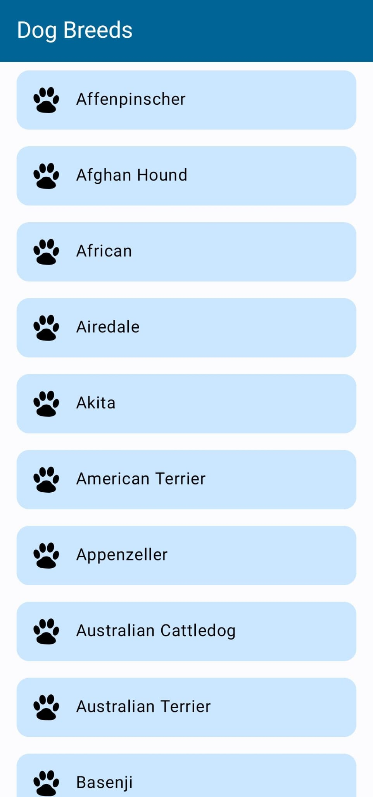
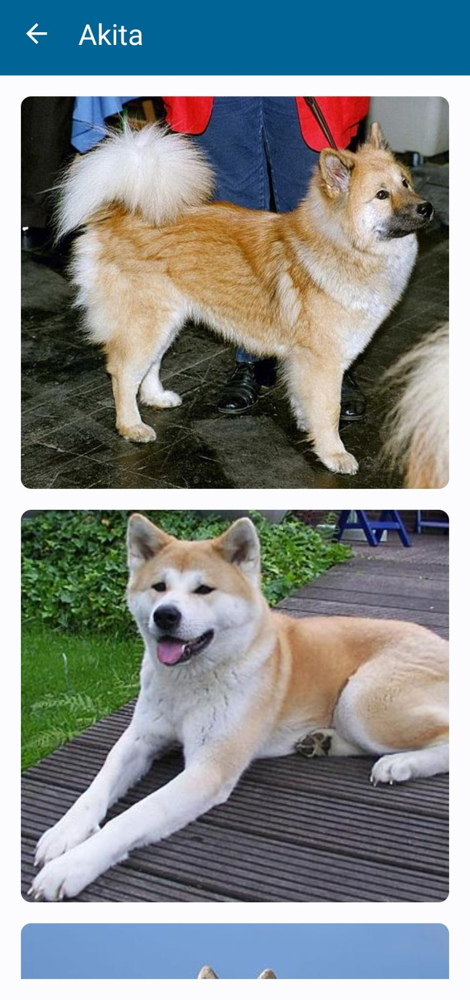

# DogBreeds - Clean Architecture and MVVM
This project probably doesn't need this overengineering, it is just an example of clean architecture and MVVM pattern written in kotlin. It is a simple app that shows a list of dog breeds and their images. The data is retrieved from the [Dog API](https://dog.ceo/dog-api/).

[**Project Repository**](https://github.com/alvaronunezhermida/dogbreeds)

## Screenshots

    
    

## Clean Architecture Layers

## Layers
* **Presentation Layer (MVVM)**: Contains all the Android UI related code (activities, fragments, views) and view models.
* **Use Cases Layer**: These are mainly the actions that the user can trigger. They are called by the presentation layer and they will execute the business logic.
* **Domain Layer**: These are the rules of your business.
* **Data Layer (Repositoy Pattern)**: Contains the abstract definition of the different data sources, and how they should be used.
* **Framework Layer**: Contains the implementation of the different data sources.

### Interaction between layers

## Architecture concepts used here
* [Clean Architecture](https://blog.cleancoder.com/uncle-bob/2012/08/13/the-clean-architecture.html)
* [Repository Pattern](https://developer.android.com/codelabs/basic-android-kotlin-training-repository-pattern#3)
* [MVVM](https://medium.com/@ami0275/mvvm-clean-architecture-pattern-in-android-with-use-cases-eff7edc2ef76)
* [Dependency Injection](https://developer.android.com/training/dependency-injection)
* [Unidirectional Data Flow](https://developer.android.com/jetpack/compose/architecture#:~:text=A%20unidirectional%20data%20flow%20(UDF,that%20store%20and%20change%20state))

# Includes
* **Compose** was embedded in the Breeds Screen used for the **Breeds List**
* The rest of the ui was implemented using **XML** and **View Binding**
* **Room** was used to cache the **Breeds List**
* **Flow** was used to retrieve the data from the **Repository** and to update the ui through the **ViewModel**
* **Libs Dependencies** are managed in the **buildSrc** folder
* **Error Handling** is done through **Either**

# Dependencies
* **Retrofit**: HTTP client
* **Room**: Local database
* **Flow**: Asynchronous data stream 
* **Navigation Component**: Navigation between screens
* **View Binding**: View binding
* **Compose**: UI toolkit
* **Coroutines**: Asynchronous programming
* **Dagger Hilt**: Dependency Injection
* **Moshi**: JSON parser for Kotlin
* **Coil**: Image Loading System
* **Mockito**: Mocking framework for unit tests
* **Espresso**: UI testing framework

## TO DO:
### Improvements
- Made all the ui with compose
- Add more UI tests
- Add more documentation and generate code documentation with dokka
- Add a loader while the data is being retrieved
- Add a CI to the repository
- Cache breed images
- Add search on the breeds list scene
- Add refresh button on the breed random images
- Make breed image bigger when tapping it